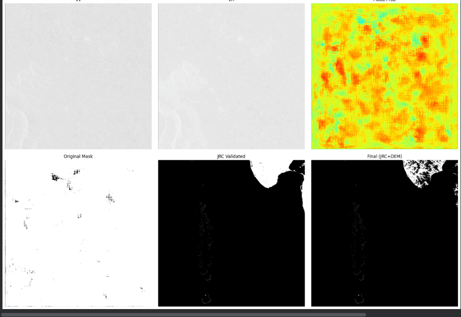
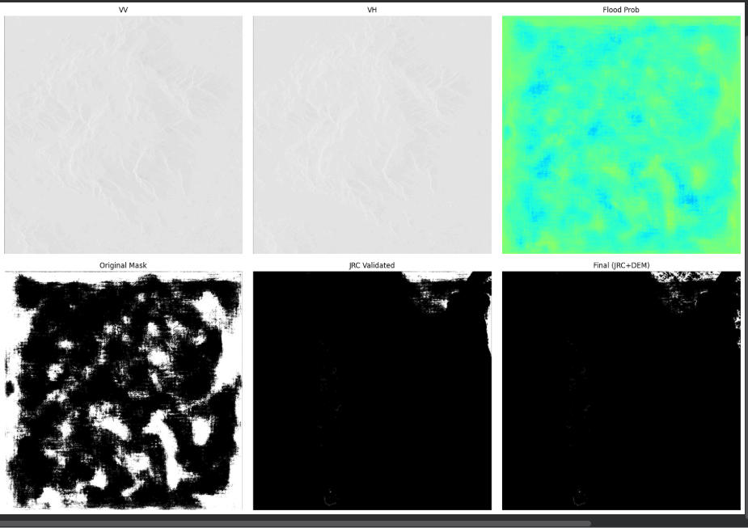
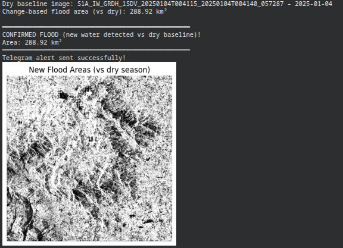
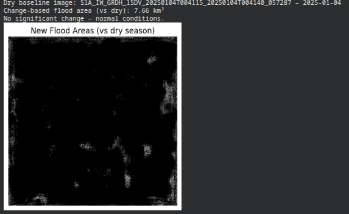

# Project Ares: Automated Rapid Environmental Surveillance

Project Ares is a satellite-based flood detection system designed for rapid environmental surveillance. It leverages deep learning (U-Net) and physics-based validation to identify flooding events with high confidence, specifically tailored for regions like Kerala.

## 🛰️ Operational Pipeline

1.  **Data Acquisition**: Automated retrieval of Sentinel-2 imagery via the STAC API.
2.  **Detection**: Preliminary flood masking using a PyTorch U-Net model with a ResNet-34 backbone.
3.  **Physics Validation**: Cross-referencing detections with HAND (Height Above Nearest Drainage) index and JRC Global Surface Water Mask.
4.  **Notification**: Critical alerts formatted for Telegram if the threat is validated.

## 📊 Detection Examples

Below are examples of the system's output on satellite data:

| Flood Detected | No Flood Detected |
| :---: | :---: |
|  |  |

## 📢 Telegram Alerts

When a flood is confirmed, the system generates a professional alert:

| Alert: Flood Confirmed | Alert: No Flood |
| :---: | :---: |
|  |  |

## 🛠️ Setup & Installation

Follow these steps to set up the environment:

1.  **Initialize Environment**:
    ```bash
    bash setup_env.sh
    ```
2.  **Activate Virtual Environment**:
    ```bash
    source venv/bin/activate
    ```
3.  **Run Pipeline Test**:
    ```bash
    python test_pipeline.py
    ```

## 🏗️ Core ML Pipeline (`ares_pipeline.py`)

The `AresPipeline` class encapsulates the model loading, inference, and notification logic.

```python
from ares_pipeline import AresPipeline

# Initialize the pipeline
pipeline = AresPipeline(telegram_token="YOUR_TOKEN", telegram_chat_id="YOUR_ID")

# Run detection
results = pipeline.run(satellite_image, hand_data=hand_array)
```

## 📜 Repository Structure
- `ares_pipeline.py`: Core logic for detection and validation.
- `requirements.txt`: Python dependencies.
- `setup_env.sh`: Environment initialization script.
- `docs/images/`: Visual assets for documentation.
- `ares.ipynb`: Exploration and prototyping notebook.
